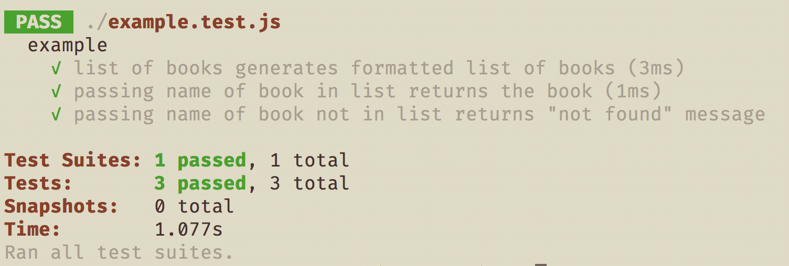
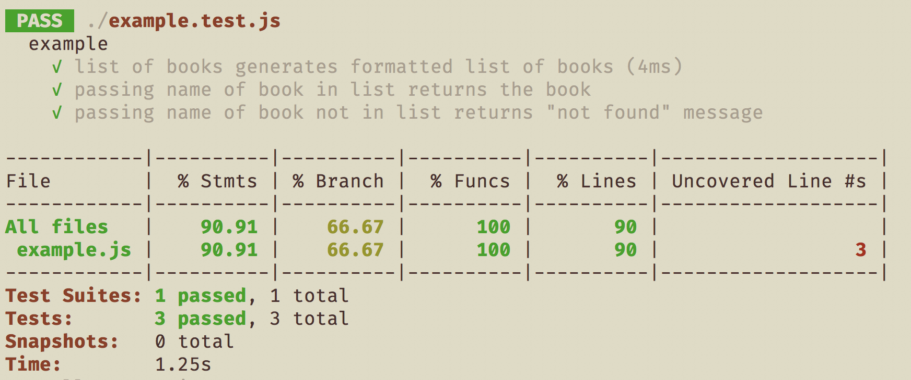
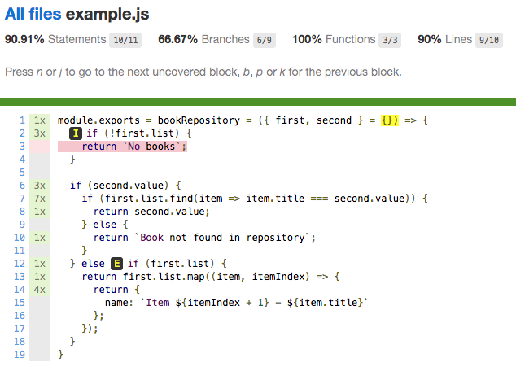

# Code coverage rocks
Small example of how code coverage highlights insufficient unit testing _and_ shows exactly which parts of your code need to be refactored.

## Installation
The repo was created with Node.js version 10.15.1, the latest LTS version should be sufficient. Just run `npm install` to prepare the project. The code provided here is not intended to do anything, it is just an example, so run the test and code coverage using

```javascript
npm run coverage
```

The coverage results are output to the `coverage` folder and you can see the html summary report at `coverage/lcov-report/index.html` which should open locally in your browser. Note, the `coverage` folder is not part of this repo - it will be created when you run `npm run coverage`.

## Results

The code example is contrived and not something that would pass a code review! However the code looks reasonable at first glance (if you squint).

The test results _look_ sensible enough



If we pull in the coverage report too, we immediately see there is a problem



Open the coverage report, found at `coverage/lcov-report/index.html`, in your browser - a double-click should do it - and look at the coverage report on the code itself _t_he problems stick out like a sore thumb!_



Now we know exactly where the tests and the code are not up to standard - time to refactor and get our gold-plated 100% coverage.